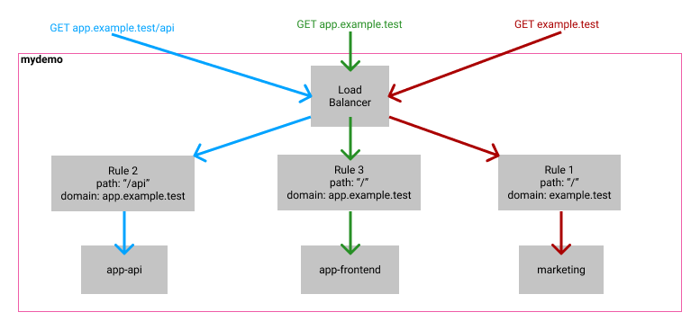

# aws-copilot-demo
AWS Copilot CLI Example app

This repository demonstrates the steps and necessary configuration to deploy multiple containers using AWS Copilot CLI.

The application architecture consists of a website accessible at `example.test`, as well as an application accessible at `app.example.test`. There is also an API available at `app.example.test/api`.

In the diagram below, you can see the basic architecture and how the application requests are routed using a shared load balancer.

To achieve this infrastructure, you can use the following steps to implement using your own domain. _Replace `example.test` with your own domain of course.

1. `copilot app init --domain example.test`
2. `copilot env init` - Create a `test` environment
3. `copilot svc init -n marketing` - Create the marketing service as a `Load Balanced Web Service`
4. Update the `http` map in `copilot/marketing/manifest.yml`
    - Set `path` to `/`
    - Add `alias: example.test`
5. `copilot svc deploy -n marketing`
6. `copilot svc init -n app-api` - Create the marketing service as a `Load Balanced Web Service`
7. Update the `http` map in `copilot/app-api/manifest.yml`
    - Set `path` to `api`
    - Add `alias: app.example.test`
8. `copilot svc deploy -n app-api`
9. `copilot svc init -n app-frontend` - Create the marketing service as a `Load Balanced Web Service`
10. Update the `http` map in `copilot/app-frontend/manifest.yml`
    - Set `path` to `/`
    - Add `alias: app.example.test`
11. `copilot svc deploy -n app-api`

After all of this setup, you will be able to access all endpoints at their desired destinations.

- `example.test` - Renders `Marketing Works!`
- `app.example.test` - Renders `Frontend Works!`
- `app.example.test/api` - Renders `API Works!`

You may also run this locally using docker compose which creates a local nginx proxy to act as the load balancer. You will need to add two entries to your `/etc/hosts` file to run this example:

- `127.0.0.1 app.example.test`
- `127.0.0.1 example.test`
